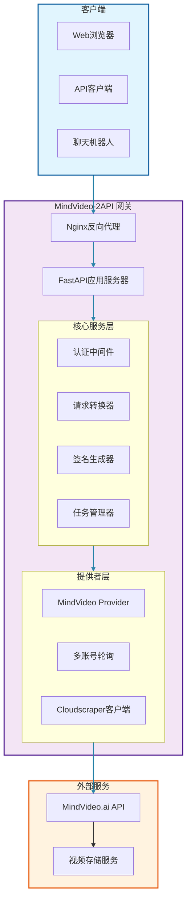
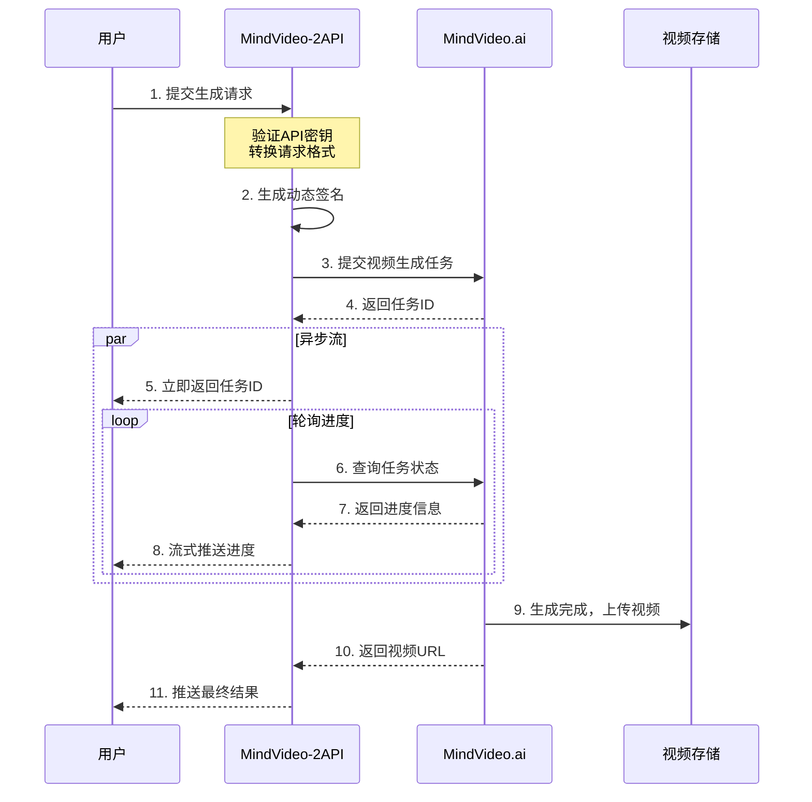
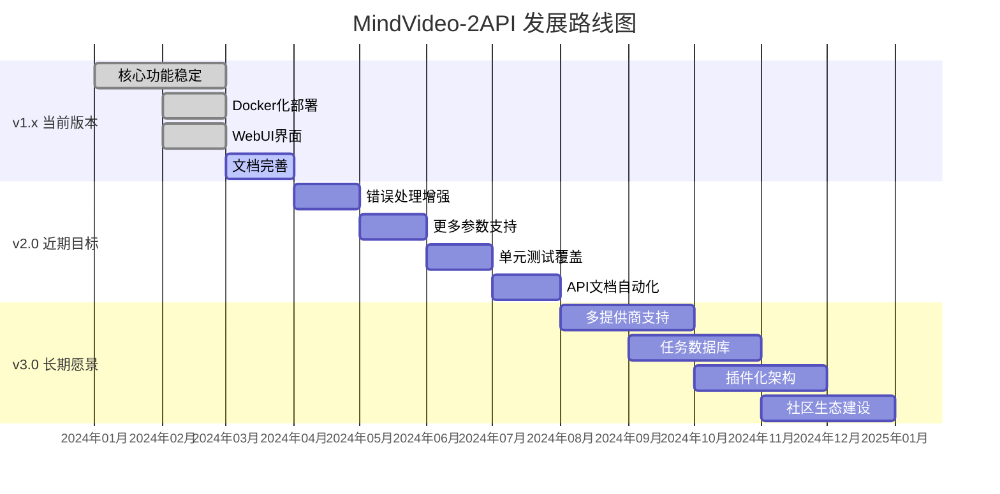

# mindvideo-2api
<video controls src="https://github.com/user-attachments/assets/a2eeea91-bf2a-43bb-afe6-2031e19a93f4">
  您的浏览器不支持HTML5视频标签。
</video>

# 🧠 MindVideo-2API: 你的私人AI视频生成大师 🎬

<div align="center">


**"我们不是在编写代码，我们是在用二进制的语言，为想象力插上翅膀。"**

**中文** | [English](README.en.md) 🌍

[](README.md#-懒人一键部署教程-docker)
[](README.md#-如何使用-api--webui)
[](README.md#-如何使用-api--webui)

</div>

## 🎯 快速开始

<div align="center">

```bash
git clone https://github.com/lzA6/mindvideo-2api.git
cd mindvideo-2api
cp .env.example .env
# 编辑 .env 文件配置你的认证信息
docker-compose up -d
```

**访问 http://localhost:8088 开启你的AI视频生成之旅!**

</div>

---

## 📋 目录

- [🌟 项目亮点](#-项目亮点)
- [🏗️ 系统架构](#️-系统架构)
- [🚀 快速部署](#-快速部署)
- [🎮 使用指南](#-使用指南)
- [🔧 API 文档](#-api-文档)
- [💡 核心原理](#-核心原理)
- [🛠️ 技术栈](#️-技术栈)
- [📁 项目结构](#-项目结构)
- [🎯 应用场景](#-应用场景)
- [📊 功能对比](#-功能对比)
- [🗺️ 发展路线](#️-发展路线)
- [🤝 贡献指南](#-贡献指南)
- [📄 许可证](#-许可证)

---

## 🌟 项目亮点

<div align="center">

| 特性 | 描述 | 状态 |
|------|------|------|
| 🎯 **OpenAI 兼容 API** | 使用熟悉的 OpenAI 格式调用视频生成 | ✅ 已实现 |
| 🔄 **异步任务处理** | 非阻塞式任务提交和进度查询 | ✅ 已实现 |
| 🔐 **动态签名算法** | 自动处理复杂的身份验证签名 | ✅ 已实现 |
| 👥 **多账号轮询** | 支持多个账号自动负载均衡 | ✅ 已实现 |
| 🐳 **Docker 部署** | 一键容器化部署 | ✅ 已实现 |
| 🌐 **WebUI 界面** | 直观的网页测试界面 | ✅ 已实现 |

</div>

### 🎨 设计理念

> **"技术应该服务于创造力，而不是限制它。"**

我们相信：
- 🌍 **开放与兼容** - 将闭源服务转化为开放标准
- 🔧 **开发者友好** - 提供熟悉的接口和完整文档  
- 🚀 **简单高效** - 复杂的技术，简单的使用
- 💡 **持续创新** - 不断探索新的可能性和优化

---

## 🏗️ 系统架构

<div align="center">



</div>

### 🔄 数据流程图

<div align="center">



</div>

---

## 🚀 快速部署

### 🐳 Docker 一键部署（推荐）

<div align="center">

**只需3步，5分钟完成部署！** ⏱️

</div>

#### 步骤 1: 获取代码

```bash
# 克隆项目仓库
git clone https://github.com/lzA6/mindvideo-2api.git
cd mindvideo-2api
```

#### 步骤 2: 配置认证信息

1. **获取 MindVideo Auth Token**:
   - 登录 [MindVideo.ai](https://www.mindvideo.ai/)
   - 按 `F12` 打开开发者工具
   - 进入 **Network** 标签页
   - 刷新页面，找到任意 `api.mindvideo.ai` 请求
   - 复制 `authorization` 头中的 Token（去掉 `Bearer `）

2. **配置环境变量**:
   ```bash
   cp .env.example .env
   ```
   
   编辑 `.env` 文件：
   ```env
   # API 访问密钥 - 请务必修改！
   API_MASTER_KEY=your-super-secret-api-key-here
   
   # 服务端口
   NGINX_PORT=8088
   
   # MindVideo 认证令牌
   MINDVIDEO_AUTH_TOKEN_1="你的Auth Token"
   
   # 可选：添加更多账号实现负载均衡
   # MINDVIDEO_AUTH_TOKEN_2="第二个账号Token"
   # MINDVIDEO_AUTH_TOKEN_3="第三个账号Token"
   ```

#### 步骤 3: 启动服务

```bash
docker-compose up -d
```

**🎉 完成！服务已运行在 http://localhost:8088**

### 👨‍💻 手动部署

适合开发者和定制化需求：

```bash
# 1. 创建虚拟环境
python -m venv venv
source venv/bin/activate  # Linux/Mac
# venv\Scripts\activate  # Windows

# 2. 安装依赖
pip install -r requirements.txt

# 3. 配置环境变量（同上）
cp .env.example .env
# 编辑 .env 文件...

# 4. 启动服务
uvicorn main:app --host 0.0.0.0 --port 8000 --workers 1
```

---

## 🎮 使用指南

### 🌐 WebUI 界面（推荐新手）

访问 `http://localhost:8088` 打开内置的Web界面：

<div align="center">


</div>

**使用步骤：**
1. 🔑 在 `API Key` 输入你的 `API_MASTER_KEY`
2. 🎯 选择视频模型和比例
3. 💬 输入创意提示词
4. 🚀 点击"生成视频"按钮
5. 📊 实时查看生成进度
6. 🎬 完成后自动播放视频

---

## 🔧 API 文档

### 🔑 认证头

所有API请求都需要包含认证头：

```http
Authorization: Bearer your-api-master-key
```

### 📋 API 端点概览

| 方法 | 端点 | 描述 | 类型 |
|------|------|------|------|
| `POST` | `/v1/images/generations` | 提交视频生成任务 | 异步 |
| `GET` | `/v1/tasks/{task_id}/stream` | 流式获取任务进度 | SSE |
| `POST` | `/v1/chat/completions` | 聊天式生成（阻塞） | 同步 |

### 1. 🎯 提交视频生成任务

创建异步视频生成任务，立即返回任务ID。

**Endpoint:** `POST /v1/images/generations`

**请求示例:**
```bash
curl -X POST "http://localhost:8088/v1/images/generations" \
  -H "Content-Type: application/json" \
  -H "Authorization: Bearer your-api-key" \
  -d '{
    "prompt": "一只可爱的猫咪在太空弹吉他，电影质感，4K分辨率",
    "model": "sora-2-free", 
    "size": "1280x720"
  }'
```

**请求参数:**
```json
{
  "prompt": "string, 视频描述提示词",
  "model": "string, 模型名称 (如: sora-2-free)",
  "size": "string, 视频尺寸 (如: 1280x720, 1920x1080)"
}
```

**成功响应:**
```json
{
  "task_id": 123456,
  "status": "submitted"
}
```

### 2. 🔄 流式获取进度

通过Server-Sent Events实时获取任务进度。

**Endpoint:** `GET /v1/tasks/{task_id}/stream`

**请求示例:**
```bash
curl -N "http://localhost:8088/v1/tasks/123456/stream" \
  -H "Authorization: Bearer your-api-key"
```

**流式响应示例:**
```json
{"status": "processing", "progress": 10, "remark": "排队中..."}
{"status": "processing", "progress": 50, "remark": "生成中..."}  
{"status": "completed", "url": "https://video.mindvideo.ai/xxx.mp4"}
```

### 3. 💬 聊天式生成

OpenAI兼容的聊天接口，阻塞直到生成完成。

**Endpoint:** `POST /v1/chat/completions`

**请求示例:**
```bash
curl -X POST "http://localhost:8088/v1/chat/completions" \
  -H "Content-Type: application/json" \
  -H "Authorization: Bearer your-api-key" \
  -d '{
    "model": "sora-2-free",
    "messages": [
      {
        "role": "user", 
        "content": "生成一个视频：海浪拍打着沙滩，夕阳西下，电影质感"
      }
    ]
  }'
```

**成功响应:**
```json
{
  "id": "chatcmpl-123",
  "object": "chat.completion",
  "created": 1677652288,
  "model": "sora-2-free",
  "choices": [{
    "index": 0,
    "message": {
      "role": "assistant",
      "content": "视频已生成：https://video.mindvideo.ai/xxx.mp4"
    },
    "finish_reason": "stop"
  }]
}
```

---

## 💡 核心原理

### 🎭 API 包装技术

MindVideo-2API 的核心是**API逆向工程与包装技术**：

```python
# 简化的工作流程
用户请求 (OpenAI格式) 
    → 格式转换 (MindVideo格式)
    → 动态签名生成 (i-sign)
    → 发送到MindVideo API
    → 处理响应
    → 返回标准化结果
```

### 🔐 动态签名算法

关键的 `i-sign` 签名生成过程：

```python
class MindVideoSigner:
    def generate_sign(self) -> str:
        # 1. 生成随机数和时间戳
        nonce = str(uuid.uuid4().hex)[:16]
        timestamp = int(time.time() * 1000)
        
        # 2. 构建签名字符串
        sign_str = f"nonce={nonce}&timestamp={timestamp}&app_key={APP_KEY}"
        
        # 3. MD5哈希生成签名
        signature = hashlib.md5(sign_str.encode()).hexdigest()
        
        # 4. 返回紧凑JSON
        return json.dumps({
            "nonce": nonce,
            "timestamp": timestamp, 
            "sign": signature
        }, separators=(',', ':'))
```

### 🔄 智能轮询机制

```python
async def stream_task_progress(task_id: int):
    start_time = time.time()
    
    while time.time() - start_time < TIMEOUT:
        await asyncio.sleep(POLLING_INTERVAL)
        
        # 查询任务状态
        status = await query_task_status(task_id)
        
        if status.completed:
            yield {"status": "completed", "url": status.url}
            return
        else:
            yield {"status": "processing", "progress": status.progress}
    
    raise TimeoutError("任务轮询超时")
```

---

## 🛠️ 技术栈

<div align="center">

| 层级 | 技术 | 版本 | 用途 |
|------|------|------|------|
| **🌐 前端** | HTML5/CSS3/JavaScript | - | WebUI界面 |
| **⚡ 后端** | FastAPI | 0.104+ | API服务器 |
| **🐍 语言** | Python | 3.10+ | 核心逻辑 |
| **🎯 异步** | Uvicorn | 0.24+ | ASGI服务器 |
| **🐳 容器** | Docker & Docker Compose | 20.10+ | 容器化部署 |
| **🔁 代理** | Nginx | 1.18+ | 反向代理 |
| **🔧 工具** | Cloudscraper | 1.2+ | 绕过Cloudflare |
| **📝 验证** | Pydantic | 2.4+ | 数据验证 |
| **📊 日志** | Loguru | 0.7+ | 结构化日志 |

</div>

### 🏆 技术选型理由

- **FastAPI**: 高性能，自动API文档，类型提示
- **Docker**: 环境一致性，快速部署，易于扩展  
- **Cloudscraper**: 专门应对Cloudflare防护
- **Pydantic**: 数据验证，设置管理，开发体验优秀

---

## 📁 项目结构

```
mindvideo-2api/
├── 🐳 部署文件
│   ├── docker-compose.yml          # Docker编排配置
│   ├── Dockerfile                  # 应用容器镜像
│   └── nginx.conf                  # Nginx反向代理配置
│
├── ⚙️ 配置文件  
│   ├── .env.example                # 环境变量模板
│   └── requirements.txt            # Python依赖
│
├── 🚀 应用入口
│   └── main.py                     # FastAPI应用主文件
│
├── 📦 核心代码 (app/)
│   ├── __init__.py
│   │
│   ├── 🔧 核心配置 (core/)
│   │   ├── __init__.py
│   │   └── config.py               # Pydantic设置管理
│   │
│   ├── 🌉 服务提供者 (providers/)
│   │   ├── __init__.py
│   │   ├── base_provider.py        # 提供者基类
│   │   └── mindvideo_provider.py   # MindVideo具体实现
│   │
│   └── 🛠️ 工具类 (utils/)
│       ├── __init__.py
│       ├── security.py             # 签名算法
│       └── sse_utils.py            # SSE工具函数
│
└── 🌐 静态资源 (static/)
    ├── index.html                  # WebUI主页面
    ├── style.css                   # 样式文件
    └── script.js                   # 前端交互逻辑
```

---

## 🎯 应用场景

<div align="center">

| 场景 | 描述 | 适用用户 |
|------|------|----------|
| 🤖 **聊天机器人** | 集成到Discord、Telegram等聊天平台 | 机器人开发者 |
| 🎨 **创意工具** | 个人AI视频创作和内容生成 | 内容创作者 |
| 🔧 **应用集成** | 在应用中添加AI视频生成功能 | 应用开发者 |
| 🎓 **学习研究** | AI和API开发技术学习 | 学生、研究者 |
| ⚡ **原型验证** | 快速验证视频生成产品概念 | 创业者、产品经理 |

</div>

### 💼 使用案例

**案例1: Discord视频生成机器人**
```python
# 伪代码示例
@bot.command()
async def generate_video(ctx, *, prompt):
    video_url = await mindvideo_api.generate(prompt)
    await ctx.send(f"视频已生成: {video_url}")
```

**案例2: 自动化内容生产**
```python
# 结合GPT生成文案 + 自动生成视频
article = gpt.generate_article(topic)
video_prompt = f"根据文章生成视频: {article}"
video_url = mindvideo_api.generate(video_prompt)
```

---

## 📊 功能对比

<div align="center">

| 特性 | MindVideo官方 | MindVideo-2API |
|------|---------------|----------------|
| **API 格式** | 私有格式 | ✅ OpenAI兼容 |
| **异步支持** | ❌ 有限 | ✅ 完整异步流 |
| **多账号** | ❌ 不支持 | ✅ 自动轮询 |
| **部署方式** | ❌ 仅Web | ✅ Docker/本地 |
| **集成难度** | ⭐⭐☆☆☆ | ✅ ⭐⭐⭐⭐⭐ |
| **文档完整性** | ⭐⭐☆☆☆ | ✅ ⭐⭐⭐⭐⭐ |

</div>

---

## 🗺️ 发展路线

### 🎯 版本规划

<div align="center">



</div>

### 🚀 详细规划

#### ✅ 已完成
- [x] OpenAI兼容API接口
- [x] 动态签名算法
- [x] 异步任务流
- [x] Docker容器化部署
- [x] WebUI测试界面

#### 🎯 v2.0 目标（2024 Q2-Q3）
- [ ] **增强错误处理**: 自动重试、失败恢复
- [ ] **更多生成参数**: 支持风格、负向提示等
- [ ] **完整测试覆盖**: 单元测试、集成测试
- [ ] **性能优化**: 响应时间、资源使用优化

#### 🌟 v3.0 愿景（2024 Q4）
- [ ] **多提供商架构**: 支持Runway、Pika等
- [ ] **任务持久化**: SQLite/PostgreSQL数据库
- [ ] **插件系统**: 社区扩展支持
- [ ] **智能路由**: 基于成本、速度的智能选择

---

## 🤝 贡献指南

我们欢迎所有形式的贡献！🎉

### 💡 如何贡献

1. **报告问题** 🐛
   - 使用 [GitHub Issues](https://github.com/lzA6/mindvideo-2api/issues)
   - 提供详细的重现步骤和环境信息

2. **功能请求** 💡
   - 描述你的使用场景和需求
   - 讨论技术实现的可行性

3. **代码贡献** 🔧
   ```bash
   # 1. Fork 项目
   # 2. 创建功能分支
   git checkout -b feature/amazing-feature
   # 3. 提交更改
   git commit -m 'Add amazing feature'
   # 4. 推送到分支
   git push origin feature/amazing-feature
   # 5. 创建 Pull Request
   ```

4. **文档改进** 📝
   - 修正错别字和语法错误
   - 补充使用示例和教程
   - 翻译其他语言版本

### 🎖️ 贡献者公约

- 尊重所有社区成员
- 建设性讨论技术问题
- 遵循代码风格规范
- 测试你的修改
- 更新相关文档

---

## 📄 许可证

本项目采用 **Apache License 2.0** 开源协议。

**重要提示**: 
- ✅ 允许个人和商业使用
- ✅ 允许修改和分发
- ✅ 允许专利使用
- 📝 需要保留版权声明
- ⚠️ 不对用户行为承担责任

**法律免责**: 本项目仅用于学习和研究目的。使用者应遵守MindVideo.ai的服务条款，并承担因使用本项目而产生的所有责任。

---

## 🙏 致谢

感谢所有让这个项目成为可能的贡献者：

- **lzA6** - 项目创始人和核心开发者
- **FastAPI社区** - 优秀的Web框架
- **Docker社区** - 容器化技术
- **所有测试者和反馈者** - 你们的建议让项目更好

---

<div align="center">

## 🎊 开始使用！

[](#-快速开始)

**如有问题，请查看 [GitHub Issues](https://github.com/lzA6/mindvideo-2api/issues) 或提交新问题。**

⭐ **如果这个项目对你有帮助，请给我们一个Star！** ⭐

</div>

---

<div align="center">

**用代码创造奇迹，让AI赋能想象力** ✨

</div>

